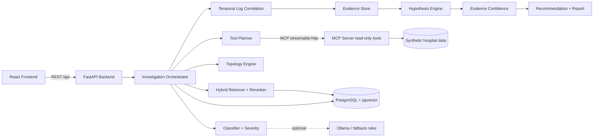

# OpsRAG-X

**Temporal Evidence-Based Incident Investigation Agent for Small-Hospital IT Infrastructure**

OpsRAG-X adalah *investigation agent* (bukan chatbot, bukan agen remediasi otomatis) yang membantu tim IT rumah sakit kecil menyelidiki insiden infrastruktur. Agen membaca tiket, memilih SOP yang berlaku **pada waktu kejadian**, mencari insiden historis, memeriksa topologi, memanggil tool MCP **read-only**, mengorelasikan log secara temporal, menyusun hipotesis, menghitung *evidence confidence score*, lalu menghasilkan laporan beserta jejak audit.

> Seluruh data adalah **sintetis** (rumah sakit fiktif "RS Yogyakarta"). Tidak ada data pasien. Semua keluaran adalah rekomendasi yang harus diverifikasi staf IT.

---

## Daftar isi

1. [Masalah dan tujuan](#masalah-dan-tujuan)
2. [Fitur](#fitur)
3. [Arsitektur](#arsitektur)
4. [Tech stack](#tech-stack)
5. [Struktur proyek](#struktur-proyek)
6. [Instalasi dan menjalankan](#instalasi-dan-menjalankan)
7. [Konfigurasi](#konfigurasi)
8. [Arsitektur database](#arsitektur-database)
9. [Arsitektur RAG](#arsitektur-rag)
10. [Arsitektur MCP](#arsitektur-mcp)
11. [Alur investigasi](#alur-investigasi)
12. [Skenario insiden](#skenario-insiden)
13. [API](#api)
14. [Frontend](#frontend)
15. [Testing dan validasi](#testing-dan-validasi)
16. [Benchmark dan eksperimen A-D](#benchmark-dan-eksperimen-a-d)
17. [Fine-tuning LoRA (opsional)](#fine-tuning-lora-opsional)
18. [Data Privacy and Safety](#data-privacy-and-safety)
19. [Kebaruan riset (research novelty)](#kebaruan-riset-research-novelty)
20. [Keterbatasan yang diketahui](#keterbatasan-yang-diketahui)
21. [Roadmap](#roadmap)

---

## Masalah dan tujuan

Di RS kecil, satu atau dua staf IT menangani jaringan, server, SIMRS, printer, dan perangkat unit. Saat tiket "SIMRS tidak bisa dibuka dari Poli 3" masuk, mereka harus mengingat SOP versi mana yang berlaku, mencari kejadian serupa, memeriksa log beberapa perangkat, dan menentukan urutan sebab-akibat secara manual.

Tujuan OpsRAG-X:

- mempercepat investigasi dengan evidence terstruktur (FACT / INFERENCE / UNKNOWN);
- memakai konteks **waktu** (versi SOP saat kejadian, peluruhan relevansi insiden lama, urutan kejadian di log);
- **menolak menyimpulkan** root cause bila evidence langsung tidak cukup;
- menyimpan seluruh langkah agar dapat diaudit dan di-*replay*.

## Fitur

- Klasifikasi tiket (kategori, severity, scope, entitas, petunjuk waktu) dengan aturan + LLM opsional yang divalidasi skema.
- Retrieval hibrida versi-sadar waktu untuk SOP dan insiden historis (pgvector HNSW + fallback TF-IDF).
- Analisis topologi (BFS jalur, scope dampak, perangkat bersama).
- Perencana tool bersyarat (kategori x scope, maks 14 tool); LLM hanya boleh memangkas rencana.
- 10 tool MCP read-only dengan semantik *snapshot as-of* (T + 5 menit) pada data sintetis.
- Korelasi log temporal, deteksi pola sebab-akibat, dan 9 hipotesis bersaing.
- Evidence confidence score dengan *gating* evidence langsung dan penalti ambiguitas/cakupan.
- Rekomendasi (hanya langkah verifikasi/mitigasi manual), laporan, ekspor JSON/PDF.
- Audit trail: `incident_events`, `tool_executions`, `investigation_evidence`, snapshot konfigurasi + input, serta fitur *replay* dan *compare*.
- Benchmark 50 item dengan eksperimen A-D yang dihitung dari eksekusi nyata.
- Frontend 17 halaman (React + TypeScript) tanpa data palsu: semua dari API.
- Mode fallback (aturan) bila Ollama tidak tersedia; aplikasi tetap berjalan penuh.
- Akun pengguna: halaman Masuk dan Daftar, sesi cookie HttpOnly, kata sandi di-hash (PBKDF2-SHA256); semua endpoint API (selain health dan auth) memerlukan login.

## Arsitektur



Prinsip desain: **log dan dokumen adalah data, bukan instruksi** (pertahanan prompt-injection), root cause tidak pernah di-hard-code (orchestrator tidak membaca `scenario_id`), dan seluruh tool bersifat baca-saja.

## Tech stack

| Lapisan | Teknologi |
|---|---|
| Backend | Python 3.10+, FastAPI, Pydantic v2, SQLAlchemy 2, Alembic, httpx, pandas, numpy, scikit-learn, PyMuPDF, ReportLab |
| Database | SQLite (mode lokal), atau PostgreSQL 16 + pgvector (HNSW cosine) untuk Docker/produksi |
| AI / RAG | Embedding `BAAI/bge-small-en-v1.5` (sentence-transformers, opsional) atau `hashing-lexical-384` (deterministik); Ollama (default `qwen2.5:7b`) opsional |
| MCP | MCP Python SDK (FastMCP, streamable-http) + fasad REST |
| Frontend | React 18, TypeScript, Vite, Tailwind, Lucide, Recharts, TanStack Query, React Router |
| Kualitas | pytest, ruff, black, mypy, eslint, tsc |
| Deploy | Docker Compose (postgres, backend, frontend, mcp-server, profil `ollama` opsional) |

## Struktur proyek

```
opsrag-x/
├── backend/
│   ├── app/
│   │   ├── ai/              classifier, planner, hypothesis, confidence, LLM provider, prompts, formatter
│   │   ├── api/             router: incidents, investigations, devices, logs, sops, analytics, health, ai
│   │   ├── database/        models SQLAlchemy, session, migrasi Alembic
│   │   ├── evaluation/      benchmark A-D
│   │   ├── investigation/   orchestrator, correlation, evidence builders, topology, recommendation
│   │   ├── mcp/             klien MCP (allow-list read-only)
│   │   ├── rag/             chunking, embeddings, retriever, reranker, ingestion
│   │   ├── schemas/         skema Pydantic
│   │   └── services/        inventori, log, seed, SOP, monitoring
│   ├── tests/               99 test (pytest)
│   └── Dockerfile, requirements*.txt, alembic.ini
├── mcp-server/              server MCP + 10 tool read-only (tools/*.py)
├── frontend/                React + TS (17 halaman, komponen reusable)
├── scripts/                 generate data, SOP PDF, bootstrap, ingest, embeddings, benchmark, health_check
├── training/                dataset + skrip LoRA opsional
├── data/                    raw CSV sintetis, SOP PDF, dokumen infrastruktur, benchmark, hasil
├── docker-compose.yml, Makefile, .env.example, pyproject.toml
```

## Quick start lokal (paling mudah: tanpa Docker, tanpa PostgreSQL)

Prasyarat: **Python 3.10+** saja (diuji di 3.10 dan 3.13). (Node tidak perlu; UI hasil build sudah disertakan di `frontend/dist`.)

```bash
python3 -m venv .venv
source .venv/bin/activate            # Windows: .venv\Scripts\activate
pip install -r backend/requirements.txt
python scripts/run_local.py          # atau: make local
```

Lalu buka **http://localhost:8000** (API docs: http://localhost:8000/docs). Perintah itu menyiapkan database SQLite (`data/opsragx.db`), mengisi data dummy rumah sakit sintetis, menjalankan MCP server (read-only) dan backend, lalu membuka UI. Daftar akun di halaman Masuk, lalu coba: *Incidents -> INC-2026-001 -> Start Investigation*.

Opsi: `--reset` (hapus database lalu mulai dari nol), `--port 8080`, `--host 0.0.0.0` (akses dari jaringan), `--llm` (pakai Ollama bila berjalan; tanpa itu otomatis mode fallback aturan).

Masalah umum:

| Gejala | Solusi |
|---|---|
| `Python 3.10+ is required` | pasang Python 3.10 atau lebih baru lalu buat ulang `.venv` |
| `Missing Python packages` | aktifkan venv, lalu `pip install -r backend/requirements.txt` |
| `Port 8000 ... already in use` | `python scripts/run_local.py --port 8080` |
| Layar UI kosong/tidak ada UI | folder `frontend/dist` hilang: pasang Node 20+, jalankan lagi (build otomatis) |
| Ingin mulai ulang bersih | `python scripts/run_local.py --reset` |

> Mode lokal memakai embedder hashing (tanpa unduhan model) dan SQLite. PostgreSQL + pgvector tetap didukung untuk Docker/produksi (lihat di bawah).

---

## Instalasi dan menjalankan

### Opsi A - Docker Compose

```bash
cp .env.example .env
docker compose up --build -d          # postgres + mcp-server + backend + frontend
# opsional LLM lokal (CPU, lebih lambat):
docker compose --profile ollama up -d
docker compose exec ollama ollama pull qwen2.5:7b
```

Backend otomatis menjalankan migrasi + seed + ingest + embedding (`scripts/bootstrap.py --if-empty`).
Frontend: http://localhost:3000, Swagger: http://localhost:8000/docs, MCP: http://localhost:8001.

> Default image memakai embedder hashing. `INSTALL_SBERT=1 docker compose up --build` menambahkan sentence-transformers (unduhan besar).

### Opsi B - Lokal dengan PostgreSQL (pengembangan)

Prasyarat: Python 3.10+, Node 20+, PostgreSQL 16 dengan ekstensi `vector`. Jalankan target `make` dengan `DB_URL=postgresql+psycopg://...` (tanpa itu, `make seed`/`make dev` memakai SQLite).

```bash
make setup                         # venv, dependensi backend/mcp, npm install
createdb opsragx && psql -d opsragx -c 'CREATE EXTENSION vector'   # hanya untuk PostgreSQL
make seed                          # migrasi + seed data sintetis + ingest SOP + embedding (idempoten)
make dev                           # MCP server :8001, backend :8000, frontend :5173
```

### Perintah Makefile

| Target | Fungsi |
|---|---|
| `make local` | menjalankan semuanya dengan SQLite (tanpa Docker/PostgreSQL) |
| `make setup` | membuat venv dan memasang dependensi |
| `make data` | membangkitkan ulang data sintetis + SOP PDF (deterministik) |
| `make seed` | migrasi + seed (idempoten) |
| `make ingest` | ingest SOP/dokumen + buat embedding |
| `make dev` | menjalankan seluruh stack lokal |
| `make test` | pytest (SQLite + hashing embedder, tanpa layanan eksternal) |
| `make lint` | ruff, black --check, mypy, eslint, tsc |
| `make format` | ruff --fix + black |
| `make benchmark` | benchmark 50 item (butuh MCP server hidup) |
| `make health` | health check live |
| `make demo` | bootstrap lalu investigasi INC-2026-001 (daftar akun sementara otomatis) |

## Konfigurasi

Semua variabel ada di `.env.example` (database, LLM, embedding, MCP, bobot retrieval, ambang confidence). Bobot retrieval dinormalisasi otomatis. `DEMO_MODE=true` membuat tool MCP mengembalikan snapshot sintetis pada waktu insiden + 5 menit.

## Arsitektur database

15 tabel (UUID PK + timestamp): `users`, `devices`, `servers`, `services`, `incidents`, `incident_events`, `investigations`, `investigation_evidence`, `tool_executions`, `logs`, `resolutions`, `historical_incidents`, `sop_documents`, `sop_versions`, `sop_chunks`, ditambah `alembic_version`.

- Kolom `embedding` bertipe `Vector(384)` (JSON pada SQLite untuk test); indeks **HNSW cosine** pada `sop_chunks` dan `historical_incidents` dibuat di migrasi `0001`.
- `investigations` menyimpan `stages`, `config_snapshot`, `input_snapshot`, `report`, skor, dan durasi sehingga hasil dapat diaudit dan di-replay.
- `investigation_evidence` menyimpan jenis (FACT/INFERENCE/UNKNOWN), tag, relasi temporal (before/during/after/unrelated), peran (supporting/contradicting/context), dan prioritas sumber 1-9.

## Arsitektur RAG

- **Chunking** SOP PDF per bagian (Indikasi, Prasyarat, Langkah, Eskalasi, dst.) dengan header `SOP-xxx | vX | Berlaku: tanggal | Status | Judul`.
- **Versi-sadar waktu**: untuk insiden pada waktu *T*, dipilih versi terbaru dengan `effective_date <= T` (8 SOP, 11 versi).
- **Skor hibrida**: `final = 0.45 semantic + 0.25 temporal + 0.10 category + 0.10 service + 0.10 source` (dapat dikonfigurasi, dinormalisasi).
- **Peluruhan temporal**: `exp(-ln2/half_life * |dt|)` dengan half-life 30 hari (historis), 180 hari (SOP), 10 menit (log).
- **Reranker deterministik**: `0.88 hybrid + 0.08 lexical overlap + 0.04 unit match`.
- Embedding: `SentenceTransformerEmbedder` jika terpasang, selain itu `HashingEmbedder` (384 dim). Fallback keyword TF-IDF bila vektor tidak ada.

## Arsitektur MCP

Server FastMCP (`/mcp`, streamable-http, stateless) + fasad REST (`/api/tools/{nama}`, `/health`, `/tools`). Backend hanya boleh memanggil tool pada allow-list `READ_ONLY_TOOLS`:

`get_server_status`, `check_http`, `check_dns`, `ping_host`, `query_service_status`, `search_logs`, `get_device_info`, `search_previous_incident`, `get_topology_path`, `get_network_interface_status`.

Tidak ada tool `execute_command`, `restart_server`, `delete_file`, `shutdown_server`, atau `change_router_config`. Setiap panggilan memiliki timeout, galat terstruktur, dan dicatat di `tool_executions`.

## Alur investigasi

1. **Klasifikasi** kategori/severity/scope/entitas/petunjuk waktu.
2. **SOP retrieval** versi-sadar waktu.
3. **Pencarian insiden historis** dengan peluruhan temporal.
4. **Inspeksi topologi** (jalur, perangkat bersama, scope).
5. **Diagnostik MCP** (rencana tool bersyarat, hanya baca).
6. **Korelasi log** (onset per domain, pola sebab-akibat, `0.5 urutan + 0.25 exp(-lag/600) + 0.25 volume`).
7. **Analisis root cause**: 9 hipotesis (`H_NET_ACCESS`, `H_ENDPOINT`, `H_APP`, `H_DNS`, `H_DB`, `H_OVERLOAD`, `H_CORE`, `H_AUTH`, `H_CONFIG`); skor = evidence 0.35, temporal 0.20, topologi 0.15, historis 0.10, state 0.10, sumber 0.10.
8. **Rekomendasi + laporan** dengan keterbatasan dan langkah pengumpulan evidence tambahan.

**Evidence confidence score** = skor hipotesis x faktor cakupan tool (0.75 + 0.25 x tool_ok/planned) x faktor ambiguitas (0.9 bila selisih dengan hipotesis kedua < 0.10), maks 0.99. Skor ini bukan probabilitas statistik. Kesimpulan hanya diberikan bila confidence >= 0.40 **dan** ada dukungan evidence langsung >= 0.30; selain itu laporan menyatakan root cause belum dapat ditentukan.

## Skenario insiden

Data dibangkitkan deterministik (`SEED=20260928`). Delapan tiket contoh + 50 deskripsi benchmark.

| Tiket | Skenario | Hasil investigasi (dijalankan ulang, mode fallback) |
|---|---|---|
| INC-2026-001 | S1: Poli 3, SW-POLI3 `Gi0/48` CRC/latensi naik, packet loss PC Poli 3 | network, confidence 0.8469 (`H_NET_ACCESS`) |
| INC-2026-002 | S2: DNS internal tidak resolve | dns, 0.9262 |
| INC-2026-003 | S3: timeout database SIMRS | database, 0.8466 |
| INC-2026-004 | S4: server aplikasi overload | server, 0.7981 |
| INC-2026-005 | S5: unit Farmasi tidak bisa akses aplikasi | network, 0.9135 |
| INC-2026-006/007/008 | Kontrol: evidence tidak cukup (login, kasir, printer lab) | root cause **tidak disimpulkan** (confidence 0.12-0.17) |

Kontrol 006-008 sengaja memverifikasi bahwa sistem menolak mengklaim root cause tanpa evidence langsung. Halaman *Create Incident* di frontend memungkinkan membuat tiket baru pada waktu kejadian skenario manapun dan menjalankan investigasi secara live.

## Akun dan keamanan sesi

Saat pertama dibuka, aplikasi menampilkan halaman **Masuk**; pilih **Daftar** untuk membuat akun (nama, email, kata sandi minimal 8 karakter). Akun pertama menjadi `admin`, akun berikutnya `it_support`. Tidak ada akun bawaan.

- Kata sandi disimpan sebagai hash PBKDF2-SHA256 dengan salt acak; sesi berupa cookie `HttpOnly` bertanda tangan HMAC (masa berlaku 7 hari). Skrip dapat memakai `Authorization: Bearer <token>`.
- Percobaan masuk yang gagal dibatasi (8 kali per 5 menit per email dan alamat IP).
- Kunci penanda tangan dibuat acak sekali dan disimpan di `data/.secret_key`. Untuk hosting atur `SECRET_KEY` dan `COOKIE_SECURE=true` (HTTPS).
- Endpoint: `POST /api/auth/register`, `/login`, `/logout`, `GET /api/auth/me`.

## API

41 path (Swagger di `/docs`). Ringkasan:

- `GET/POST /api/incidents`, `GET /api/incidents/{id}`, `POST /api/incidents/{id}/investigate` (202, latar belakang + polling), `POST .../resolve`, `GET .../events`
- `GET /api/investigations`, `/{id}`, `/{id}/timeline`, `/{id}/evidence`, `/{id}/tools`, `POST /{id}/replay`, `GET /{id}/compare/{other}`, `/{id}/export/json`, `/{id}/export/pdf`
- `GET /api/devices`, `/servers`, `/services`, `/topology`, `/logs`, `/logs/correlated`, `/sops`, `/historical-incidents`
- `GET /api/dashboard/stats`, `/api/analytics/investigations`, `/api/analytics/benchmark`, `POST /api/analytics/benchmark/run`
- `GET /api/ai/config`, `POST /api/ai/test/llm`, `POST /api/ai/test/mcp`, `GET /api/health`

Galat dikembalikan dalam bentuk `{error, message, request_id}` (header `X-Request-ID`), tanpa membocorkan detail internal.

## Frontend

17 halaman: Dashboard, Incidents, Create Incident, Incident Detail, Investigations, Investigation (progress per tahap + laporan), Timeline, Evidence, Topology Map, Devices, Servers, Services, Logs, SOPs, Historical Incidents, Analytics (benchmark), AI Config. Seluruh data dari backend; tersedia state loading, skeleton, empty, error, toast, dialog konfirmasi, dan paginasi. Ikon memakai Lucide (tanpa emoji).

## Testing dan validasi

```bash
make test        # 99 passed
make lint        # ruff, black, mypy (backend/app 58 file, mcp-server 14 file), eslint, tsc: bersih
make build       # frontend production build
make health      # health check live
```

Hasil terakhir (dijalankan pada sesi pembuatan):

- `pytest`: **99 passed** (Python 3.10 dan 3.13).
- Lint/typecheck: ruff, black, mypy, eslint, tsc bersih.
- `npm run build`: berhasil.
- `docker compose config`: valid.
- Migrasi Alembic upgrade/downgrade diuji pada PostgreSQL 16 + pgvector 0.6 nyata.
- `scripts/health_check.py --investigate INC-2026-001`: **18/18** pemeriksaan lulus (health, DB, RAG, MCP, penolakan akses anonim, registrasi + sesi, Swagger, proxy frontend, investigasi selesai, evidence 30 item, 12 panggilan tool ter-audit, ekspor JSON dan PDF).
- 17 halaman frontend dimuat di Chromium headless tanpa galat konsol.

## Benchmark dan eksperimen A-D

`make benchmark` menjalankan 50 item (10 parafrasa x 5 skenario) dan menulis `data/processed/benchmark_results.json`. Angka di bawah dihitung dari eksekusi nyata (embedder hashing, klasifikasi berbasis aturan, MCP live):

| Eksp. | Deskripsi | Klasifikasi | Precision@8 | SOP hit | Tool F1 | Root-cause agreement | Evidence coverage |
|---|---|---|---|---|---|---|---|
| A | Tanpa RAG | 0.98 | - | - | - | 0.78 | 0.00 |
| B | RAG tanpa temporal | 0.98 | 0.965 | 0.693 | - | 1.00 | 0.00 |
| C | RAG + temporal | 0.98 | 0.8275 | 0.693 | - | 1.00 | 0.00 |
| D | Pipeline penuh (temporal + topologi + MCP) | 0.98 | 0.8175 | 0.703 | 0.871 | 1.00 | 0.941 |

**Catatan jujur**: (1) benchmark sintetis dan label ditulis dari kosakata yang sama dengan data historis, sehingga angka optimistis untuk jenis kegagalan baru; (2) pembobotan temporal pada benchmark ini *menurunkan* precision@8 (B 0.965 vs C 0.8275) karena insiden terbaru sering berasal dari pola lain; manfaat temporal terlihat pada pemilihan versi SOP dan korelasi log, bukan pada metrik ini; (3) metrik yang tidak relevan untuk suatu eksperimen dilaporkan kosong, bukan nol; (4) tidak ada klaim performa di luar angka ini.

## Fine-tuning LoRA (opsional)

Folder `training/` berisi pembangkit dataset (klasifikasi, pemilihan tool, format respons, dll.), persiapan train/val, evaluasi baseline, dan skrip `train_lora.py`. **Tidak diperlukan** untuk menjalankan aplikasi. Lihat `training/README.md`.

## Data Privacy and Safety

- Hanya data sintetis; tidak ada data pasien atau identitas pribadi. Jangan memasukkan data pasien nyata ke sistem ini.
- Semua tool MCP **read-only**; klien menerapkan allow-list. Tidak ada otomasi destruktif.
- Log dan dokumen diperlakukan sebagai **data**, bukan instruksi (mitigasi prompt-injection); LLM hanya memangkas rencana tool dan merangkum, tidak dapat menambah tool di luar allow-list.
- Sistem menyebut diri *investigation agent*; keluaran adalah rekomendasi yang wajib diverifikasi manusia.
- Skor adalah *evidence confidence score*, bukan kepastian; root cause tidak diklaim bila evidence tidak cukup.
- Error dibersihkan sebelum dikirim ke klien; setiap request punya `X-Request-ID`.
- Untuk penggunaan nyata: tambahkan autentikasi/otorisasi, TLS, pembatasan jaringan MCP, dan kebijakan retensi log.

## Kebaruan riset (research novelty)

1. **Retrieval versi-sadar waktu**: SOP dipilih berdasarkan versi yang berlaku pada saat insiden, bukan versi terbaru.
2. **Peluruhan temporal berbeda per sumber** (historis, SOP, log) dalam skor hibrida yang dapat diaudit.
3. **Evidence terpisah dari inferensi**: FACT/INFERENCE/UNKNOWN dengan relasi temporal dan peran, sehingga kontradiksi tercatat.
4. **Gating evidence langsung**: konteks saja (SOP, riwayat) tidak cukup untuk menyimpulkan root cause; sistem lebih memilih "belum dapat ditentukan".
5. **Audit dan replay** investigasi dengan snapshot konfigurasi/input serta perbandingan antar-run.

## Keterbatasan yang diketahui

- Mode lokal SQLite menghitung kemiripan vektor di Python (bukan pgvector); cukup untuk data contoh, bukan untuk skala besar.
- Seluruh data dan benchmark **sintetis**; tidak ada evaluasi pada infrastruktur nyata. Generalisasi belum terbukti.
- Embedding yang dipakai selama validasi adalah `hashing-lexical-384`, **bukan** `bge-small-en-v1.5`; jalur sentence-transformers tersedia tetapi tidak dijalankan di lingkungan validasi.
- **Jalur LLM (Ollama) belum diuji** dengan model sungguhan; seluruh hasil di atas berasal dari mode fallback (aturan).
- **Docker**: `docker-compose.yml` valid secara sintaks (`docker compose config`), tetapi `docker compose up --build` **belum berhasil diverifikasi**: daemon Docker dapat dijalankan di sandbox pembuatan, namun registry Docker Hub diblokir (HTTP 403) sehingga image dasar (`python`, `node`, `nginx`, `pgvector`) tidak bisa di-pull. Jalankan di mesin dengan akses internet biasa dan laporkan bila ada galat.
- Fine-tuning LoRA: dataset dan skrip tersedia, tetapi **loop pelatihan belum dieksekusi** (tanpa GPU/`peft`); tidak ada klaim hasil model fine-tuned.
- Klasifikasi benchmark 0.98 (49/50): satu tiket farmasi ambigu diklasifikasikan network, bukan application.
- Investigasi berjalan via `BackgroundTasks` (satu proses); belum ada antrean terdistribusi.
- Belum ada autentikasi pengguna; tabel `users` disiapkan tetapi tidak ditegakkan.
- Pada benchmark ini pembobotan temporal menurunkan precision@8 (lihat catatan di atas).
- Bundle frontend ~730 kB (belum di-*code-split*).

## Roadmap

Autentikasi + RBAC, antrean job (mis. worker terpisah), code-splitting frontend, evaluasi dengan embedding sentence-transformers dan LLM lokal, integrasi sumber monitoring nyata (SNMP/Zabbix/Prometheus) lewat tool MCP read-only baru, serta evaluasi LoRA bila GPU tersedia.
